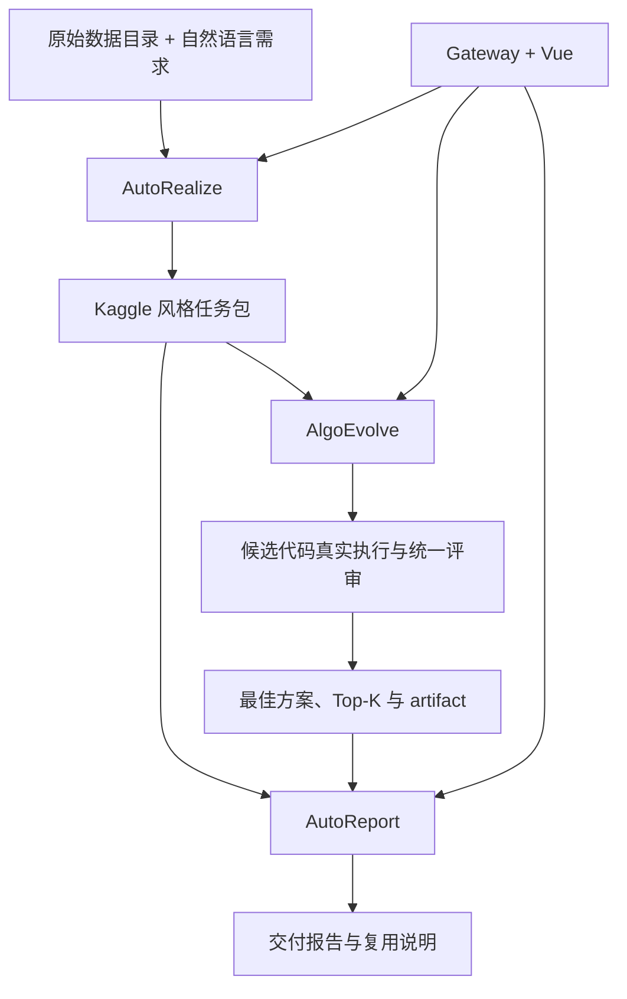

# AutoDecision

[](https://www.python.org/)
[](https://vuejs.org/)
[](https://fastapi.tiangolo.com/)
[](LICENSE)

AutoDecision 是一套从**原始数据与自然语言需求**出发，自动完成任务定义、算法搜索、代码执行、结果评审和交付报告生成的智能决策系统。它的目标不只是让大模型写一段代码，而是产出可以被其他系统复用的预测模型、决策求解器或强化学习策略，并保留任务合同、指标、候选比较、运行证据和恢复状态。

系统由三个可独立运行的 Core 项目和一个统一的 Web 控制面组成：

- **AutoRealize**：把数据和需求编译成完整的 Kaggle 风格任务包与机器可读合同；
- **AlgoEvolve**：在统一 evaluator 下搜索、执行、调试和改进预测或决策方案；
- **AutoReport**：比较已验证候选，解释最佳方案，并生成训练、推理和系统接入说明；
- **Gateway + Vue**：管理模型、资源、任务、阶段运行、恢复、搜索树、日志和产物。

> [!WARNING]
> AlgoEvolve 会执行 LLM 生成的 Python 代码。请只在受控环境中处理可信数据，并配置合理的 CPU、内存、磁盘、网络和运行时限制。当前项目更适合单机研究与内部工具场景；暴露到不可信网络前，应额外部署身份认证、进程隔离和网络沙箱。

## 最终能得到什么

一次完整任务会产生四类可审计产物：

| 产物              | 作用                                                                                   |
| ----------------- | -------------------------------------------------------------------------------------- |
| Kaggle 风格任务包 | `description.md`、数据访问协议、评估合同、输出合同和可选的 `sample_submission.csv` |
| 搜索与执行结果    | 搜索树、节点代码、真实执行输出、统一指标、Result Review、最佳方案和 Top-K              |
| 可复用方案        | 模型、预处理器、策略或求解器 artifact，以及机器可读的`solution_manifest.json`        |
| 交付报告          | 问题建模、重要约束、候选对比、最佳方法、提升来源、直接推理和重新训练说明               |

## 支持范围

| 问题类型     | 当前定位             | 典型任务                                                               |
| ------------ | -------------------- | ---------------------------------------------------------------------- |
| 机器学习预测 | 核心支持             | 分类、回归、时序预测及其他`data -> prediction` 任务                  |
| 决策与优化   | 部分支持             | 数学规划、组合优化、调度、分配、路径规划、启发式与混合求解             |
| 强化学习     | 部分支持，实验性更强 | 可定义 state、action、transition、reward、终止条件和合法动作的序贯决策 |

Optimization 在系统中属于 Decision 问题。启发式、数学优化、局部/元启发式搜索、RL 和混合方法是可由搜索过程选择的方法族，而不是互斥的问题类型。决策与 RL 的可靠性取决于任务是否提供明确约束、可行性校验器和统一评分函数；项目不宣称可以自动解决任意形式的决策问题。

## 系统工作流



### 1. AutoRealize：从数据和需求生成任务合同

AutoRealize 先用确定性解析器清点文件、识别 CSV/Excel 布局、统计 schema、空值、类型、类别和表间关系，再让 LLM 处理业务语义、冲突归并、低置信度消歧和任务建模。QDI 调查允许 LLM 规划只读探查，但脚本能力、超时和输出均受宿主限制。

最终产出包括：

- `description.md`：完整任务书；
- `realize_report/main_task_protocol.json`：任务事实、数据访问、评估和输出合同的统一入口；
- `realize_report/automl_context_pack.json`：供下游程序读取的结构化上下文；
- `realize_report/automl_context.md`：适合放入 Agent 上下文的机器可执行说明；
- 数据认知、问题调查、一致性审查、事件流和 LLM 用量记录。

### 2. AlgoEvolve：搜索、执行和验证方案

AlgoEvolve 把任务归为 Prediction 或 Decision，并固定 evaluator 语义、指标方向和输出合同。LLM 负责 Draft、Debug、Improve、Evolution 和 Fusion 等候选生成与评审；确定性代码负责语法与接口预检、隔离执行、有限数值检查、持久化和资源控制。

多个 Worker 在同一搜索树上并行工作：选择父节点时使用 UCT、临时 virtual visits 和父节点扩展锁分散并发；节点完成后再回传真实 reward。候选只有在代码真实执行、指标可比较且 Result Review 未发现 bug 后，才参与最佳方案和 Top-K 竞争。

搜索过程会保存 journal、检查点、随机状态、在途动作、模型 artifact 和 Top-K。任务中断后可以在原树上继续，而不是重新从第一个 Draft 开始。

### 3. AutoReport：从有效候选生成交付报告

AutoReport 读取 AutoRealize 的任务合同，以及 AlgoEvolve 已经产生的代码、指标、评审、最佳方案、Top-K 和 artifact。它不会补造不存在的 baseline、接口或模型文件。

报告重点回答：

1. 问题和关键约束是什么；
2. 问题如何建模；
3. 最佳方法具体怎样工作；
4. 其他候选用了什么方法；
5. 最佳方案相对候选提升在哪里；
6. 如何直接加载已训练模型、策略或求解器；
7. 如何重新训练、重新求解并接入其他系统。

### 4. Gateway 与前端：统一编排

Vue 前端只访问 Gateway。Gateway 持久化任务和全局设置，生成三个 Core 的任务级配置，启动或停止独立服务任务，并将三个阶段的快照聚合成统一界面。Core 服务不在 Gateway 进程里直接执行长任务，因此 Gateway 重启后可以重新连接仍在运行的 AlgoEvolve 作业。

## 服务组成

| 服务            | 默认地址                   | OpenAPI   | 作用                           |
| --------------- | -------------------------- | --------- | ------------------------------ |
| AutoRealize API | `http://127.0.0.1:18101` | `/docs` | 数据认知与任务定义             |
| AlgoEvolve API  | `http://127.0.0.1:18103` | `/docs` | 预测、优化、决策和 RL 方案搜索 |
| AutoReport API  | `http://127.0.0.1:18104` | `/docs` | 交付报告生成                   |
| Gateway API     | `http://127.0.0.1:18080` | `/docs` | 配置、任务编排与状态聚合       |
| Vue Frontend    | `http://127.0.0.1:5173`  | -         | 用户操作界面                   |

Core 服务使用 `/health` 健康检查，Gateway 使用 `/api/health`。

## 仓库结构

```text
AutoDecision/
|-- core/
|   |-- AutoRealize/       # Git 子模块：数据认知与任务定义
|   |-- AlgoEvolve/        # Git 子模块：方案搜索、执行与验证
|   `-- AutoReport/        # Git 子模块：交付报告生成
|-- frontend/
|   |-- backend/           # FastAPI Gateway
|   `-- ui/                # Vue 3 + TypeScript + Vite
|-- scripts/               # 启动、停止、重启、状态、日志和仓库审计
|-- runs/                  # 默认任务输出目录，不进入 Git
|-- environment.yml        # Conda Python 3.12 环境
|-- requirements.txt       # 四个 Python 服务的聚合依赖
|-- LICENSE                # Apache License 2.0
`-- .gitmodules            # Core 子模块映射
```

三个 Core 项目也可以独立安装和调用：

- [AutoRealize](core/AutoRealize/README.md)
- [AlgoEvolve](core/AlgoEvolve/README.md)
- [AutoReport](core/AutoReport/README.md)

## 环境要求

- Git 2.30+；
- Conda、Miniconda 或 Miniforge；
- **Python 3.12**；
- Node.js `>=20.19 <23` 和 npm；
- 可访问所配置的 OpenAI-compatible LLM API；
- 足够的磁盘空间保存输入副本、搜索节点、模型和日志。

CPU 环境可以运行完整系统。GPU、NPU 或其他加速卡不是启动必需项；若候选方案需要深度学习，请安装与本机驱动和硬件匹配的 PyTorch 或设备运行时。

## 获取代码

必须同时拉取三个 Core 子模块：

```bash
git clone --recurse-submodules https://github.com/DonaLdZY/AutoDecision.git
cd AutoDecision
```

如果主仓库已经克隆：

```bash
git submodule sync --recursive
git submodule update --init --recursive
```

## 使用 Conda 和 Python 3.12 安装

根目录的 `environment.yml` 会创建名为 `autodecision` 的 Python 3.12 环境：

```bash
conda env create -f environment.yml
conda activate autodecision
python -m pip install --upgrade pip
python -m pip install -r requirements.txt
```

已有环境可以这样更新：

```bash
conda activate autodecision
conda env update -n autodecision -f environment.yml --prune
python -m pip install --upgrade pip
python -m pip install -r requirements.txt
```

确认当前终端确实使用 Python 3.12：

```bash
python -c "import sys; print(sys.executable); print(sys.version)"
```

需要视觉、NLP、音频、地理、化学等额外算法库时，再安装 AlgoEvolve 的领域依赖：

```bash
python -m pip install -r core/AlgoEvolve/requirements_domain.txt
```

如需 GPU 版 PyTorch，请先按 [PyTorch 官方安装器](https://pytorch.org/get-started/locall本项目不固定 CUDA、ROCm、XPU、MPS 或 Ascend 版本。y/) 或设备厂商文档安装匹配版本，再安装项目其余依赖。

安装前端依赖：

```bash
cd frontend/ui
npm ci
cd ../..
```

## 配置模型与密钥

推荐先启动服务，再在前端右上角的“全局设置”中配置。全局设置支持模型库和角色分配：

| 角色               | 用途                                                          |
| ------------------ | ------------------------------------------------------------- |
| AutoRealize        | 文件认知、任务建模和任务书生成                                |
| AutoRealize Vision | 可选的图片语义认知                                            |
| AutoML Code        | Draft、Debug、Improve、Evolution 和 Fusion                    |
| AutoML Feedback    | 代码评审、结果评审，以及 AutoReport；未配置时回退到 Code 模型 |
| Embedding          | AlgoEvolve 全局语义记忆，可选                                 |

每个模型可以配置模型名、Base URL、API Key、thinking 模式、reasoning effort、输出上限和上下文窗口。DeepSeek 默认配置保留 `/beta` endpoint，以便在支持时使用 prefix completion；其他 OpenAI-compatible Provider 应填写其实际兼容地址和字段。

全局设置默认写入：

```text
frontend/config/global_settings.yaml
```

该文件已被 `.gitignore` 排除。Gateway 写入时会限制文件权限，向浏览器返回配置时会清除明文 Key。不要把该文件、任务级临时配置、日志或 `.env` 提交到 Git。

可以用环境变量改变全局设置路径和 Python：

```text
AUTODECISION_GLOBAL_SETTINGS_PATH
AUTODECISION_PYTHON_EXECUTABLE
```

也可以直接提供 Provider Key。PowerShell 示例：

```powershell
$env:DEEPSEEK_API_KEY = "your-api-key"
$env:ALGOEVOLVE_CODE_API_KEY = "your-api-key"
$env:ALGOEVOLVE_FEEDBACK_API_KEY = "your-api-key"
$env:ALGOEVOLVE_EMBEDDING_API_KEY = "your-embedding-key"
```

Bash 示例：

```bash
export DEEPSEEK_API_KEY="your-api-key"
export ALGOEVOLVE_CODE_API_KEY="your-api-key"
export ALGOEVOLVE_FEEDBACK_API_KEY="your-api-key"
export ALGOEVOLVE_EMBEDDING_API_KEY="your-embedding-key"
```

三个 Core 的默认 YAML 位于：

- `core/AutoRealize/config/config.yaml`；
- `core/AlgoEvolve/config/config.yaml`；
- `core/AutoReport/config/config.yaml`。

通过 AutoDecision 前端运行时，Gateway 会从这些模板生成任务级配置；独立运行 Core 项目时再直接使用其 YAML。

## 影响成本和运行时间的配置

前端已经按阶段组织配置。首次运行时重点检查：

| 配置                     | 主要影响                                                  |
| ------------------------ | --------------------------------------------------------- |
| 输出语言                 | 统一 AutoRealize、AlgoEvolve 和 AutoReport 的模型输出语言 |
| AutoRealize LLM 并发     | 数据认知速度、Provider 限流和瞬时 token 消耗              |
| QDI 问题/轮次/脚本上限   | 对杂乱数据的取证深度和耗时                                |
| AutoML 总步数与时间      | 搜索规模和总费用的主要上限                                |
| 并行搜索 Worker          | 同时生成/执行节点的数量及资源压力                         |
| 初始 Draft 数量          | 初始方法多样性与首轮成本                                  |
| 生成、评审和预检重试     | Provider 不稳定时的恢复能力与额外调用量                   |
| CPU、总内存和加速卡      | 整个 AlgoEvolve 任务进程树的共享预算                      |
| 报告受众、详细度、候选数 | 报告篇幅、对比深度和生成成本                              |

高并发不一定更快：Provider 限流、CPU/内存不足或多个训练任务争用同一加速卡时，过高并发会增加失败和重试。

## 一键启动

启动前先激活 Conda 环境：

```bash
conda activate autodecision
```

### Windows PowerShell

```powershell
powershell -ExecutionPolicy Bypass -File .\scripts\dev-up.ps1 -Wait -Open
```

Windows 脚本使用当前终端解析到的 `python`，所以必须先激活 `autodecision` 环境。

### Linux / macOS

```bash
./scripts/dev-up.sh --open
```

Linux/macOS 脚本优先读取 `frontend/config/global_settings.yaml` 中的 `python.executable`，然后检查当前 Conda 环境。也可以显式指定：

```bash
./scripts/dev-up.sh --python "$(which python)" --open
```

常用管理命令：

| 操作     | Windows PowerShell                                                     | Linux / macOS                |
| -------- | ---------------------------------------------------------------------- | ---------------------------- |
| 查看状态 | `powershell -ExecutionPolicy Bypass -File .\scripts\dev-status.ps1`  | `./scripts/dev-status.sh`  |
| 查看日志 | `powershell -ExecutionPolicy Bypass -File .\scripts\dev-logs.ps1`    | `./scripts/dev-logs.sh`    |
| 重启服务 | `powershell -ExecutionPolicy Bypass -File .\scripts\dev-restart.ps1` | `./scripts/dev-restart.sh` |
| 停止服务 | `powershell -ExecutionPolicy Bypass -File .\scripts\dev-down.ps1`    | `./scripts/dev-down.sh`    |

启动成功后访问 [http://127.0.0.1:5173](http://127.0.0.1:5173)。

## 首次运行示例

仓库包含一个不调用外部数据源的微型销量预测示例：

```text
examples/quickstart/input/
|-- task_requirements.md
|-- train.csv
|-- predict.csv
`-- sample_submission.csv
```

服务启动后：

1. 在全局设置中配置可用模型和 API Key；
2. 新建任务，任务名填写 `quickstart`；
3. 输入目录选择 `examples/quickstart/input` 的绝对路径；
4. 输出目录选择仓库的 `runs`，输出语言按需选择；
5. 保留较小的 AutoML 步数和时间预算，点击“执行任务”；
6. 依次查看 AutoRealize 任务合同、AlgoEvolve 搜索树和 AutoReport 报告。

示例的目标是预测 `sales`，指标为 MAE（越低越好），提交格式严格为 `row_id,sales`。`sample_submission.csv` 中的 `0` 只是格式占位值，不是可用于训练的标签。运行完整流程会调用真实 LLM API 并产生费用。

## 手动启动服务

需要分别调试时，在五个终端中从对应目录启动：

```bash
# Terminal 1: core/AutoRealize
python -m uvicorn autorealize.service_api:app --host 127.0.0.1 --port 18101

# Terminal 2: core/AlgoEvolve
python -m uvicorn service_api:app --host 127.0.0.1 --port 18103

# Terminal 3: core/AutoReport
python -m uvicorn service_api:app --host 127.0.0.1 --port 18104

# Terminal 4: frontend/backend
python -m uvicorn app:app --host 127.0.0.1 --port 18080

# Terminal 5: frontend/ui
npm run dev -- --host 127.0.0.1 --port 5173
```

## 使用前端运行任务

1. 打开“全局设置”，选择 Python 3.12 解释器并配置模型库与角色。
2. 新建任务，填写任务名、输入目录、输出目录和需求提示。
3. 配置 AutoRealize、AutoML、AutoReport 和任务资源。
4. 保存配置后，选择完整执行或分阶段执行。
5. 在数据理解、搜索树和报告页面查看进度、代码、指标、评审和日志。

任务操作的语义如下：

| 操作             | 语义                                                                                                         |
| ---------------- | ------------------------------------------------------------------------------------------------------------ |
| 执行 AutoRealize | 只生成或重建任务包；首次执行时会创建任务目录                                                                 |
| 执行 AutoML      | 启动新的 AlgoEvolve 搜索；必须已有 AutoRealize 输出、输入目录中的`description.md`，或同时配置 Goal 与 Eval |
| 继续执行 AutoML  | 在原搜索树、journal、UCT 统计和 Top-K 基础上追加搜索预算                                                     |
| 执行报告生成     | 使用已有 AutoML 结果生成报告；AutoML 被中断但已有有效候选时也可以执行                                        |
| 执行任务         | 从 AutoRealize 到 AlgoEvolve 再到 AutoReport 完整执行；完全重跑会要求确认并清理原执行目录                    |
| 从中断继续任务   | 根据持久化阶段和检查点继续未完成流程                                                                         |

删除任务默认只删除前端任务记录；只有明确勾选删除相关文件时才会删除系统判定为安全的任务输出目录。

## 中断、恢复和继续搜索

停止 AlgoEvolve 时，服务先请求写出最小可恢复检查点，再终止任务进程树：

- `interrupted_resumable`：检查点完整，可以继续；
- `interrupted_incomplete`：检查点不完整，系统会尝试从已有本地状态恢复，但不能保证完整；
- `completed`：预算正常耗尽，仍可以使用“继续执行 AutoML”追加搜索。

继续搜索会复用原工作区、journal、持久 UCT 统计、最佳方案和 Top-K。未完成节点的临时 virtual visits 不会污染重启后的搜索统计；旧进程的堆内存、模型实例和临时缓存不会恢复。

## 任务输出目录

默认输出位于 `runs/<task-name>/`：

```text
runs/<task-name>/
|-- autorealize/
|   |-- <输入数据副本>
|   |-- description.md
|   |-- sample_submission.csv             # 任务需要时存在
|   `-- realize_report/
|       |-- main_task_protocol.json
|       |-- automl_context.md
|       |-- automl_context_pack.json
|       |-- event_stream.jsonl
|       `-- ...
|-- automl/
|   |-- python_packages/                   # 任务隔离依赖
|   |-- dependency_installations.jsonl
|   |-- dependency_installations_summary.json
|   |-- logs/<experiment>/
|   |   |-- journal.json
|   |   |-- checkpoint_manifest.json
|   |   |-- AlgoEvolve.log
|   |   |-- llm_usage_summary.json
|   |   `-- resource_usage.json
|   `-- workspaces/<experiment>/
|       |-- best_solution/
|       |-- top_solution/
|       |-- working/
|       `-- submission/
`-- report/
    |-- report.md
    |-- report.json
    |-- report_trace.json
    |-- resolved_config.yaml
    `-- current_state.json
```

重跑 AutoML 时实验名可能追加时间戳。前端和 Gateway 会根据任务状态定位当前有效的日志与工作区。

## 复用最佳方案

最佳方案通常位于：

```text
automl/workspaces/<experiment>/best_solution/
```

`solution_manifest.json` 是首选机器入口，记录问题类型、入口函数、artifact 路径、方法族和接口版本。有限接口为：

```python
# Prediction
def train(data, artifact_dir): ...
def predict(model_path, data): ...

# Stateless or optimization Decision
def solve(model_path, data): ...

# RL or hybrid Decision
def train_policy(data, artifact_dir): ...
def rollout(model_path, data): ...
```

`predict()` 和 `rollout()` 应加载已有 artifact，不应在推理阶段偷偷重新训练。无状态启发式或数学求解器可以接受 `model_path=None`。接入其他系统时，应先解析 manifest，再按接口类型调用对应函数；完整协议见 [AlgoEvolve solution interface](core/AlgoEvolve/docs/solution_interface.md)。

## 缺失依赖与任务隔离

AlgoEvolve 默认可以在候选代码出现精确 `ModuleNotFoundError` 后，将声明的 PyPI 包安装到当前任务的隔离目录，并立即重跑同一节点。它不会修改基础 Conda 或系统 Python 环境。

安装记录和 `requirements_candidates` 写入 `automl/dependency_installations.*`。同一包每次任务只尝试一次，避免安装死循环；生成代码直接执行 pip、conda 或 shell 安装仍会被拒绝。严格部署可以把 AlgoEvolve 的 `exec.dependency_install_policy` 改为 `allowlist`。

## 资源限制

- **CPU**：预算作用于整个 AlgoEvolve 任务进程树，不是每个 Worker 各获得一份核心；
- **内存**：限制任务主进程和全部子进程共享的总内存，`0` 表示不限制；
- **加速卡**：控制任务可见设备；可见性隔离不等于设备独占或显存配额。

Windows 使用 CPU affinity 和 Job Object；Linux 优先使用 CPU affinity 与 cgroup v2；macOS 使用线程预算和进程资源限制。实际能力、限制后端、峰值和诊断写入 `resource_usage.json`。

## Gateway API

Gateway 的常用端点：

| 方法           | 路径                              | 作用                            |
| -------------- | --------------------------------- | ------------------------------- |
| `GET`        | `/api/health`                   | 健康检查                        |
| `GET/PUT`    | `/api/settings/global`          | 读取或保存脱敏后的全局设置      |
| `GET`        | `/api/resources/inventory`      | 探测 CPU、内存、Python 和加速卡 |
| `GET/POST`   | `/api/tasks`                    | 列出或创建任务                  |
| `PUT/DELETE` | `/api/tasks/{task_id}`          | 更新或删除任务                  |
| `POST`       | `/api/tasks/start`              | 执行完整任务                    |
| `POST`       | `/api/tasks/start-automl`       | 直接启动 AutoML                 |
| `POST`       | `/api/tasks/continue-automl`    | 在原树上继续 AutoML             |
| `POST`       | `/api/tasks/rerun-autorealize`  | 单独执行 AutoRealize            |
| `POST`       | `/api/tasks/rerun-autoreport`   | 单独生成报告                    |
| `POST`       | `/api/tasks/resume`             | 从中断阶段继续完整任务          |
| `POST`       | `/api/tasks/stop`               | 请求可恢复停止                  |
| `GET`        | `/api/tasks/{task_id}/snapshot` | 聚合三个阶段的前端快照          |

需要保护 Gateway API 时可以设置 `AUTODECISION_API_TOKEN`，随后除健康检查外的 `/api` 请求都必须携带 `Authorization: Bearer <token>`。跨域来源可通过逗号分隔的 `AUTODECISION_ALLOWED_ORIGINS` 配置。

## License

Copyright 2026 Bydecision.

本项目主仓库代码按 [Apache License 2.0](LICENSE) 发布。三个 Git 子模块分别包含自己的 `LICENSE`，其中 AlgoEvolve 作为 MLEvolve 的派生项目还包含必须保留的上游版权与 [NOTICE](core/AlgoEvolve/NOTICE)。分发本项目或衍生版本时，请保留适用的许可证、版权和 NOTICE 声明。
